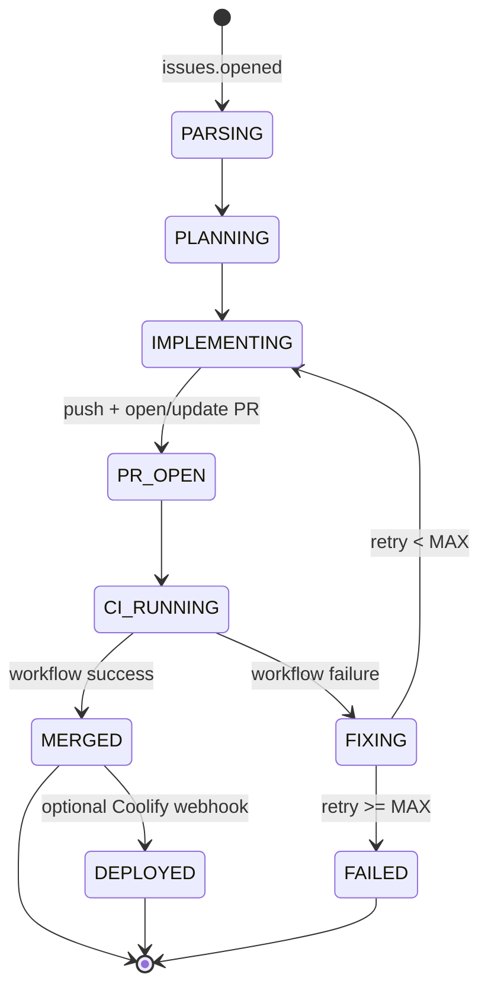

# ai-dev — Autonomous Coding Agent

Turns GitHub issues into tested, auto-merged pull requests using local models served by
**oMLX** (an MLX-based local model server with an OpenAI-compatible API). A deterministic
router currently sends all work to a single coding model, **Qwen3.6-35B-A3B-MLX-8bit**
(configurable via `MODEL_CODE` / `MODEL_DEBUG` / `MODEL_PRO`). oMLX requires an API key
(Bearer token) set via `LMSTUDIO_API_KEY`.

## What it does

When an issue is opened (optionally gated by a trigger label), the orchestrator:

1. Parses the issue into a structured spec (Qwen).
2. Generates a step-by-step plan (Qwen).
3. Clones the repo, branches `feature/issue-<n>`, implements changes (Qwen), commits, pushes.
4. Opens a PR and waits for GitHub Actions.
5. On failure: downloads CI logs, finds the root cause (DeepSeek), applies a fix (Qwen),
   pushes, and retries — up to `MAX_RETRIES` (default 5).
6. On green CI: squash-merges the PR (if `AUTO_MERGE=true`).
7. Optionally fires a Coolify deploy webhook.



## Architecture

```
src/
  index.ts            bootstrap: express + webhook endpoint + queue + poller
  config.ts           env loading/validation
  router/router.ts    deterministic task -> model
  llm/                oMLX (OpenAI-compatible) client + prompt templates
  github/             GitHub App auth, webhooks, repo/PR ops, CI run + logs
  ci/                 log extraction + polling fallback
  agent/              parse, plan, implement, debug, orchestrator (state machine), deploy hook
  storage/            SQLite (issue_jobs + model_calls) and guardrails
  utils/              logger, git runner, command runner, patch applier
```

State is persisted in SQLite so jobs resume across restarts. The job queue is an in-memory
serial queue (concurrency 1) — repos share one on-disk clone, so serialization avoids
working-tree races. Swap in Redis/BullMQ if you need multi-repo parallelism.

## Model routing

Rule-based, no LLM (`src/router/router.ts`):

| Task | Model |
| --- | --- |
| `IMPLEMENT`, `EDIT`, `GENERATE`, `PARSE`, `PLAN` | `MODEL_CODE` (Qwen) |
| `CI_ANALYSIS`, `DEBUG`, `REASONING` | `MODEL_DEBUG` (DeepSeek) |

The orchestrator addresses models by their exact oMLX id. oMLX handles loading/unloading
of MLX models on the serving host; each request also sends a JIT `ttl` (`LLM_TTL_SECONDS`,
default 900s) so an idle model can auto-unload. Today `MODEL_CODE`, `MODEL_DEBUG`, and
`MODEL_PRO` all point at the same single coding model, so no model switching occurs; set
them to different oMLX ids if you want per-task routing.

## Prerequisites

- Node.js 18+ (developed on 18.19) for local dev; the Docker image uses Node 20.
- oMLX running with the coding model available, reachable on the LAN at
  `http://192.168.4.38:1234/v1` (set `LMSTUDIO_BASE_URL`). oMLX requires an API key —
  set it in `LMSTUDIO_API_KEY`. Verify with:
  `curl -H "Authorization: Bearer $LMSTUDIO_API_KEY" http://192.168.4.38:1234/v1/models`.
- A GitHub App (below) installed on the target repo(s).
- A public hostname for the webhook (e.g. a Cloudflare tunnel).

## GitHub App setup

Create a GitHub App (Settings → Developer settings → GitHub Apps):

- **Permissions (repository):** Contents: Read & write, Pull requests: Read & write,
  Issues: Read & write, Actions: Read-only, Checks: Read-only, Metadata: Read-only.
- **Subscribe to events:** Issues, Workflow run. (Check suite optional.)
- **Webhook URL:** `https://<your-hostname>/api/github/webhooks`
- **Webhook secret:** set one and copy it into `GITHUB_WEBHOOK_SECRET`.
- Generate a **private key** (.pem) and install the App on the repo(s).

Put `GITHUB_APP_ID`, the private key (inline `GITHUB_PRIVATE_KEY` with `\n` escapes, or a
file via `GITHUB_PRIVATE_KEY_PATH`), and `GITHUB_WEBHOOK_SECRET` in `.env`.

## Cloudflare tunnel (webhook ingress)

This host's personal `cloudflare-tunnel` is token-managed and runs on the Docker bridge
network `cloudflared_default`. The compose file attaches this service to that same network,
so the tunnel can route to it **by container name**. Add a **Public Hostname** in the
Cloudflare Zero Trust dashboard (Networks → Tunnels → `cloudflare-tunnel` → Public
Hostnames):

- Subdomain / domain: `ai-dev` / `qureshi.io`  (i.e. `ai-dev.qureshi.io`)
- Service: **`http://ai-dev-orchestrator:8088`**

> Note: don't use `localhost` here — inside the tunnel container that means the tunnel
> itself. The container name works because both containers share `cloudflared_default`.
> (Running the agent with host networking instead? Then use `http://192.168.5.54:8088`.)

Then set the GitHub App webhook URL to `https://ai-dev.qureshi.io/api/github/webhooks`.

Port 8088 is used because 8080 on this host is taken by `coolify-proxy`.

## Configuration

Copy `.env.example` to `.env` and fill it in. Key settings:

- `REPO_ALLOWLIST` — comma-separated. **Empty = deny all** (safe default). Entries can be
  `owner/repo` (exact), or `owner/*` / `owner` to allow every repo under an org/user
  (covers repos added later — set the App installation to "All repositories" too).
- `TRIGGER_LABEL` — only act on issues with this label (`ai-dev`). Empty = every new issue.
- `TRIGGER_USERS` — comma-separated GitHub logins allowed to trigger (the actor who
  applies the label / opens the issue). Empty = anyone. Case-insensitive.
- `MAX_RETRIES`, `AUTO_MERGE`, `MERGE_METHOD`, `BRANCH_PREFIX`.
- `MODEL_CODE` / `MODEL_DEBUG` / `MODEL_PRO` — exact oMLX model ids (from
  `GET /v1/models`). Currently all set to `Qwen3.6-35B-A3B-MLX-8bit` (single model).
- `LMSTUDIO_API_KEY` — required Bearer token for oMLX.
- `COOLIFY_DEPLOY_HOOK_URL` — optional; POSTed after a successful merge.

## Run locally

```bash
npm install
cp .env.example .env   # then edit
npm run dev            # tsx watch, listens on PORT (default 8088)
```

Endpoints:

- `POST /api/github/webhooks` — GitHub webhook receiver (signature-verified).
- `GET /healthz` — liveness + queue depth.
- `GET /status` — active jobs (state, retries, PR, branch).

## Run with Docker

```bash
docker compose up -d --build
```

Joins the `cloudflared_default` Docker network (so the Cloudflare tunnel routes to it by
container name), publishes `127.0.0.1:8088` for local debugging, and
mounts `./data` for the SQLite DB and repo clones. oMLX is reached over the LAN at
`192.168.4.38:1234`, so host networking is not required for that. Homepage labels are
included; adjust them before deploying.

## Smoke test

`npm run smoke` exercises the deterministic router, the SQLite state machine + guardrails,
the CI log extractor, and the patch applier without needing GitHub or oMLX.

## Safety / guardrails

- Max `MAX_RETRIES` fix attempts per issue.
- One active branch/job per issue (DB `UNIQUE(owner,repo,issue_number)`).
- Never auto-merges unless **all** workflow runs for the head SHA are green.
- Repo allowlist; trigger-user allowlist; signature-verified webhooks; path-traversal-guarded patches.
- Every model call (model, prompt, response, latency) is logged to `model_calls`.

## Notes

- If a repo has **no** GitHub Actions workflows, CI can't be verified green, so the job
  will wait until `CI_WAIT_TIMEOUT_MS` and then fail rather than merge blind.
- Installation tokens are short-lived and fetched per task; they are never written to
  `.git/config` (clone scrubs the remote; fetch/push pass the token transiently).
